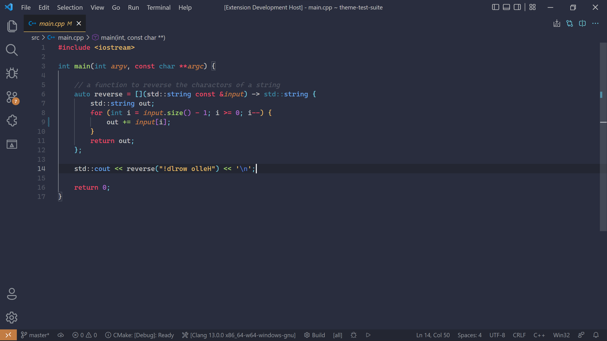

# Smooth Dark

A nice dark theme inpired by monokai and material

## Installation

You can install this theme via the [VSCode Marketplace](https://marketplace.visualstudio.com/items?itemName=PiesArentSquare.smooth-dark)

Or clone it into your ``.vscode/extensions/`` folder located:
- Linux & Mac: ``~/.vscode/extensions/``
- Windows: ``%USERPROFILE%\.vscode\extensions\``

with the command:

    git clone https://github.com/PiesArentSquare/smooth-dark.git PiesArentSquare.smooth-dark
